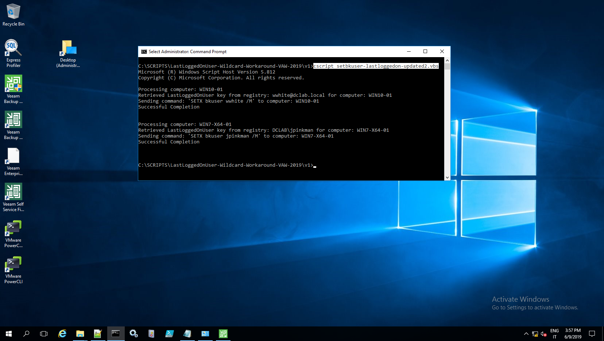
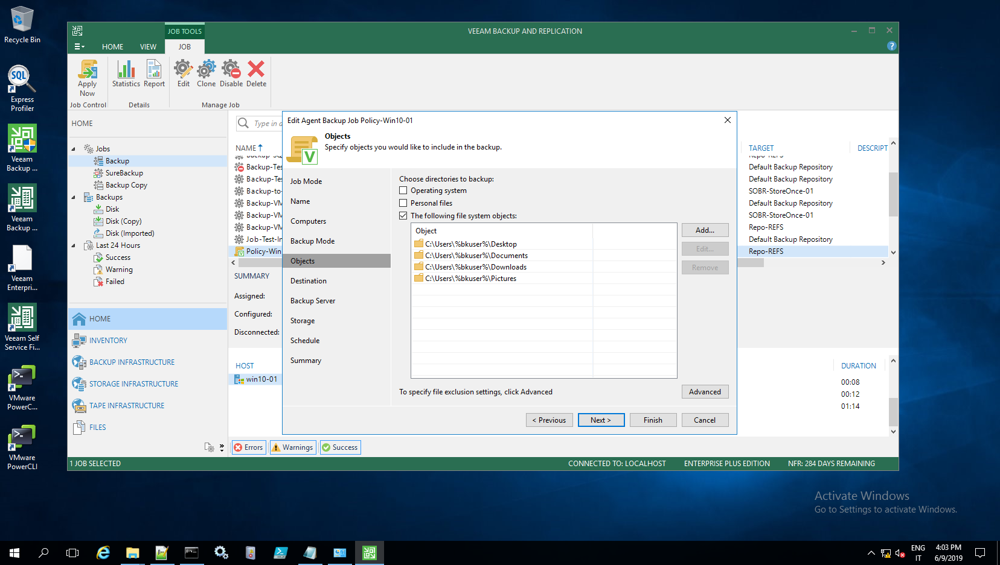

"bkuser" script
---------------

Author: Danilo Chiavari (www.danilochiavari.com)
Date:   June 9th, 2019

This script was born to facilitate backup policy creations for workstations in Veeam Backup & Replication / Veeam Agent for Windows.

The script does the following:

  -  Parses a list of computers (hostnames or IPs) from a CSV file ("list.csv"), then for each of them:
  	  -  Retrieves the last logged on user name from the Windows registry
	  -  Sets an environmental variable ("bkuser") in the system context, with the last logged on user name as value

After doing this, it is easy to leverage the "bkuser" environmental variable when creating a backup policy from within Veeam Backup & Replication (or standalone Veeam Agent as well).

For example: in order to back up only the 'Desktop' folders, "C:\Users\\%bkuser%\Desktop" can be used.

USAGE: open an elevated Command Prompt (CMD.EXE / Run as Administrator) and run the script directly.
Running the script using 'cscript' is recommended, as all "logging" (wscript.echo) output would be written to console (command prompt window) rather than pop-up boxes.

EXAMPLE: cscript C:\scripts\bkuser\bkuser.vbs

__Script execution from the backup server__

__Policy definition using the variable__

__File-level recovery from a backup__
