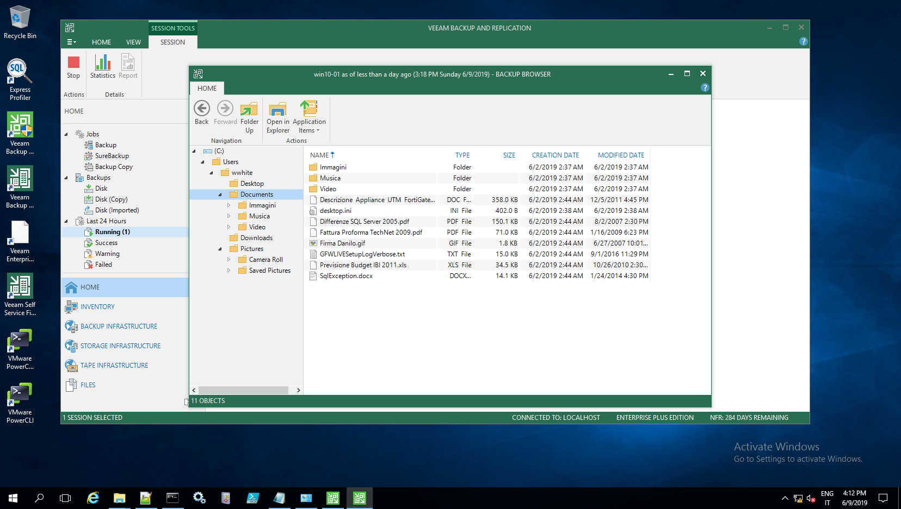

"bkuser" script
---------------

Author: Danilo Chiavari (www.danilochiavari.com)
Date:   June 9th, 2019

This script was born to facilitate backup policy creations for workstations in Veeam Backup & Replication / Veeam Agent for Windows.

The script (`bkuser.vbs`) does the following:

  -  Parses a list of computers (hostnames or IPs) from a CSV file (`list.csv`, newline-delimited), then for each of them:
  	  -  Retrieves the last logged on user name from the Windows registry
	  -  Sets an environmental variable ("bkuser") in the system context, with the last logged on user name as value

After doing this, it is easy to leverage the `bkuser` environmental variable when creating a backup policy from within Veeam Backup & Replication (or standalone Veeam Agent as well).

For example: in order to back up only the 'Desktop' folders, `C:\Users\%bkuser%\Desktop` can be used.

In order to run the script, you need to have administrative privileges on the machine you are running the script from and on all target workstations.

USAGE: open an elevated Command Prompt (Run as Administrator) and run the script directly: `C:\scripts\bkuser\bkuser.vbs`

Running the script using `cscript` is recommended, as all "logging" (`wscript.echo`) output would be written to console (command prompt window) rather than pop-up boxes.

EXAMPLE: `cscript C:\scripts\bkuser\bkuser.vbs`

---------------

_Script execution from the backup server_

_Policy definition using the variable_

_File-level recovery from a backup_

---------------

__NOTE:__ Of course, this is __very__ crude and __very__ far from perfect. 

Limitations:
- Multi-user machines cannot be properly protected this way. Best approach would be just using a policy where "Personal files" (that is, "C:\Users") checkbox is ticked
- There might be corner cases where the user who last logged on is not the "main" user (e.g. a technician). In this case you should manually re-run the script or manually adjust the variable accordingly
- Error handling is more or less non-existent

Possible future improvements:
- Implement an option to parse not only machine names/IPs, but also user names from a CSV. This way you can be sure the variable will always be set to the correct user name
